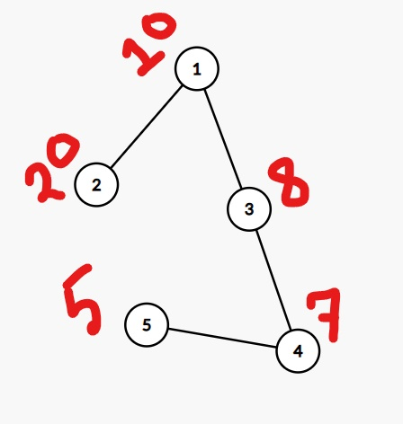
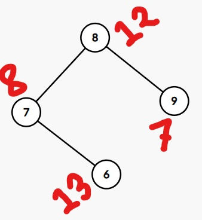

# LOJ 1263 - Equalizing Money
**Problem Statement:** </p> In this problem, there are n people in a village and each of them contains some amount of money. Now they want to distribute the money such that everyone has equal amount of money. We are given the information about the money of each person and some relations. Each relation is of the form u v. That means person u and v are capable of making money transactions. They are allowed to use transactions any number of times but they have to do integer transactions only. <br> 
Now based on the information given, we have to find whether they can redistribute the money such that each of them contains exactly same of money. 
***
### Solution Idea:

First, observe that we can represent this problem using graph. Each relation u-v means that there is an undirected edge between node u and v. So, if we make a graph using all the relations, it will be a undirected graph with one or more connected components. Now, we can make transactions between any two node if they are in the same connected component. Consider the following graph with 2 connected components (red colored value is denoting the amount of money that node contains). <br>
<p float="left">
  
   
</p>

Suppose, we want to transfer some integer amounts of money from node 1 to node 4. Say, we want to transfer 5$ from node 1 to node 4. How can we do that? We can transfer in the following order 1-->3-->4. First, we will transfer 5$ from node 1 to node 3, then we will transfer 5$ from node 3 to node 4. What does it mean? Basically it means that we can make integer transactions between any two node in the same connected component. We can't make any transaction between node 1 and node 7, as they are in the different connected component. <br>
How can we make the money of each node in the same connected component equal? Suppose, the total number of nodes in that connected component is X and total sum of money of all the nodes in that connected component is **S**. If (S mod X !=0), there is no way we can make the money of each node in that connected component equal. Otherwise, we can always make the money of each node in that connected components equals to S/X by doing the necessary transactions between nodes. 
<br>
See the code below to understand better <br>
### C++

``` c++
#include<bits/stdc++.h>
using namespace std;
#define endl '\n'
int dx[]={1,-1,0,0};
int dy[]={0,0,1,-1};
const int mxN=25;
char grid[mxN][mxN];
int n,m;
bool valid(int r,int c) {
  return (r>=0 and r<n and c>=0 and c<m and grid[r][c]!='#' and grid[r][c]!='m');
}
bool ppg(char ch) {
  return (ch=='a' or ch=='b' or ch=='c');
}
int bfs(int sx,int sy,int hx,int hy) {
  queue<pair<int,int>>q;
  vector<vector<bool>>used(n,vector<bool>(m));
  vector<vector<int>>dist(n,vector<int>(m));
  q.push({sx,sy});
  used[sx][sy]=true;
  dist[sx][sy]=0;
  while(q.size()) {
    auto cur=q.front();
    q.pop();
    int x=cur.first,y=cur.second;
    for(int i=0;i<4;i++) {
      int tx=x+dx[i];
      int ty=y+dy[i];
      if(!valid(tx,ty) or used[tx][ty]) continue;
      dist[tx][ty]=dist[x][y]+1;
      used[tx][ty]=true;
      q.push({tx,ty});
    }
  }
  return dist[hx][hy];
}
void solve() {
  cin>>n>>m;
  int hx,hy; //initial position of home
  vector<pair<int,int>>pos;
  for(int i=0;i<n;i++) {
    for(int j=0;j<m;j++) {
      cin>>grid[i][j];
      if(grid[i][j]=='h') {
        hx=i,hy=j;
      }
      if(ppg(grid[i][j])) {
        pos.push_back({i,j});
      }
    }
  }
  int da=bfs(pos[0].first,pos[0].second,hx,hy);
  int db=bfs(pos[1].first,pos[1].second,hx,hy);
  int dc=bfs(pos[2].first,pos[2].second,hx,hy);
  int ans=max({da,db,dc});
  cout<<ans<<endl;
}
int main(int argc, char const *argv[]) {
  int test_case;
  cin>>test_case;
  for(int tc=1;tc<=test_case;tc++) {
    cout<<"Case "<<tc<<": ";
    solve();
  }
}
```
> **Time Complexity: O(T\*n\*m)** <br>
> **Can you solve it in more convenient way?**

***
### Solution Idea 2:
Do we really need to run bfs three times? Actually, we can solve this problem using single bfs. Instead of finding the shortest distance from each power puff girl to home, we can find the shortest distance from **home** to each power puff girl using single bfs. This approach is much more efficient than the previous approach. Using this approach, we can also solve the problem where power puff girls are more than 3, within the same time complexity. 
### C++
``` c++
#include<bits/stdc++.h>
using namespace std;
#define endl '\n'
int dx[]={1,-1,0,0};
int dy[]={0,0,1,-1};
const int mxN=25;
char grid[mxN][mxN];
int n,m;
bool valid(int r,int c) {
  return (r>=0 and r<n and c>=0 and c<m and grid[r][c]!='#' and grid[r][c]!='m');
}
bool ppg(char ch) {
  return (ch=='a' or ch=='b' or ch=='c');
}
void solve() {
  cin>>n>>m;
  int hx,hy;
  for(int i=0;i<n;i++) {
    for(int j=0;j<m;j++) {
      cin>>grid[i][j];
      if(grid[i][j]=='h') {
        hx=i,hy=j;
      }
    }
  }
  queue<pair<int,int>>q;
  vector<vector<bool>>used(n,vector<bool>(m));
  vector<vector<int>>dist(n,vector<int>(m));
  q.push({hx,hy});
  used[hx][hy]=true;
  dist[hx][hy]=0;
  while(q.size()) {
    auto cur=q.front();
    q.pop();
    int x=cur.first,y=cur.second;
    for(int i=0;i<4;i++) {
      int tx=x+dx[i];
      int ty=y+dy[i];
      if(!valid(tx,ty) or used[tx][ty]) continue;
      dist[tx][ty]=dist[x][y]+1;
      used[tx][ty]=true;
      q.push({tx,ty});
    }
  }
  int ans=0;
  for(int i=0;i<n;i++) {
    for(int j=0;j<m;j++) {
      if(ppg(grid[i][j])) {
        ans=max(ans,dist[i][j]);
      }
    }
  }
  cout<<ans<<endl;
}
int main(int argc, char const *argv[]) {
  int test_case;
  cin>>test_case;
  for(int tc=1;tc<=test_case;tc++) {
    cout<<"Case "<<tc<<": ";
    solve();
  }
}
```
> **Time Complexity: O(T\*n\*m)**

  
